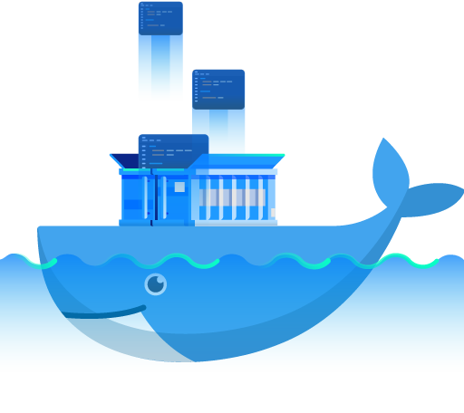
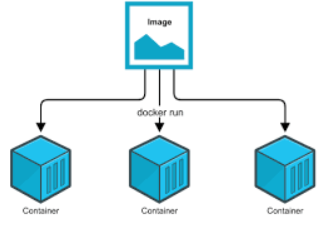

# Foundation

<p align="center">
  
</p>

In this section we will learn about images and containers.

## Images and Containers

**Images** are templates or Blueprints for creating containers. An Image has the container's code and required dependecies and tools to run a container. 
Images:
- Layer bases
- read-only
- application data is stored

On the other hand, **Containers** are the runtime unit of the software. We can create multiple containers from the same image.
Conatiners:
- Top layer
- read and write access
- data is lost on shutdown

<p align="center">
  
</p>

## Where to get an Image

There are two options:
- [Docker hub](https://hub.docker.com/): pull an image from Docker Registory
- Create your own image

1. To pull an image form [Docker hub](https://hub.docker.com/) run:
```bash
docker pull nginx
```

The above command will pull ```nginx``` image which is a web server. In this case, docker will pull the latest version of the image. If we want to specify a specific version we can run:
```bash
docker pull [NAME OF THE IMAGE]:[NAME OF THE VERSION]
```
2. Create our own image
If we want to create our onw image we must first create a ```Dockerfile```. Example of a **Dockerfile**: 

```Dockerfile
# Python app Dockerfile

# Install the python image from online registry
FROM python:3.8-slim-buster

# create app folder and make it our working directory
WORKDIR /app

# copy the requirements.txt file 
COPY requirements.txt requirements.txt

# install dependencies
RUN pip3 install -r requirements.txt

# Copy the source code into the /app folder
COPY . .

# Expose the port of the app, just for documentation
EXPOSE 80

# the command we must run when running the container, in this case a flask app
CMD ["python", "flask", "run", "--host=0.0.0.0"]
```

After creating the **Dockerfile** we can build the image using:
```bash
docker build -t [IMAGE NAME]:[IMAGE TAG] .
```

To list all images:
```bash
docker images
```
To delete an image:
```bash
docker rmi [IMAGE ID OR IMAGE NAME]
```
To delete all unused images:
```bash
docker image prune
```
To push an image to DockerHub:
```bash
docker push [IMAGE'S NAME]
```

## Run a Container

Like I said before, we can run multiple container from the same image.

To run a container run:
```bash
docker run -p [HOST'S PORT]:[CONTAINER'S PORT] -d --rm --name [NAME OF THE CONTAINER] [NAME OF THE IMAGE]
```
Let me explain:
- ```-p```: to publish a container's port to the host, the first port is the host port and the second port is the container's port.
- ```-d```: to run the container in the detached mode.
- ```--rm```: Automatically remove the container when it exits.
- ```--name```: Assign a name to the container.

To list all running containers:
```bash
docker ps
```

To list all containers:
```bash
docker ps -a
```

To stop a container:
```bash
docker stop [CONTAINER'S NAME]
```

To run a container in interactive mode:
```bash
docker run -p [HOST'S PORT]:[CONTAINER'S PORT] -it --rm --name [NAME OF THE CONTAINER] [NAME OF THE IMAGE]
```
To delete a container:
```bash
docker rm [CONTAINER NAME]
```

## Managing Data in Containers


We have three kinds of data in containers:
- Application (code + environments)
- Temporary Data
- Permanent Data

When restarting a container all new data will be removed. Solution is to use **External Data Storage**.

We have two kinds of storage:
- Volumes (managed by Docker):
  - Anonoymous Volumes
  - Named Volumes
- Bind Mounts (managed by the user)


<p align="center">
  
</p>

1. Volumes
Volumes are folders on your host machine hard drive which are mounted into containers. Volumes are created and managed by docker. Volumes can be shared among multiple containers. 

To use volume run:
```bash
docker run -p [HOST'S PORT]:[CONTAINER'S PORT] -it --rm --name [NAME OF THE CONTAINER] -v [NAME OF THE VOLUME]:[PATH/TO/VOLUME/IN/CONTAINER] [NAME OF THE IMAGE]
```
Where `-v` specifies the name of the volume and the path to which file or folder we want to use as a volume.

If docker didn't find any volume with this name, a new volume will created. On the other hand, if docker found a volume with the excat same name, he will use it.

To list all volumes:
```bash
docker volume ls
```
To delete a volume:
```bash
docker volume rm [NAME OF THE VOLUME]
```
To inspects a volume:
```bash
docker volume inspect [NAME OF THE VOLUME]
```

2. Bind Mount
Like named volumes however they are managed by the user. You must defined an  absolute path on the host machine. It is greate for persistant and editable data.
```bash
docker run -p [HOST'S PORT]:[CONTAINER'S PORT] -it --rm --name [NAME OF THE CONTAINER] -v "[ABSOLUTE/PATH/TO/THE/HOST]:[PATH/TO/VOLUME/IN/CONTAINER]" [NAME OF THE IMAGE]
```

to use read-only bind mounts add `:ro`:
```bash
-v "[ABSOLUTE/PATH/TO/THE/HOST]:[PATH/TO/VOLUME/IN/CONTAINER]:ro"
```

## Tips

1. Ignorefiles
We can add `.Dockerignore` file if we want to ignore some files and/or folders when creating a new image.

2. Arguments and Environment variables
   - Arg: 
     - not accessible 
     - in CMD
     - When building the image
     - `--build-arg`
   - ENV:
     - available inside app
     - `docker run`
     
  We can add *env variables* inside the `Dockerfile`:
  ```Dockerfile
  ENV [NAME OF THE ENV] [DEFAULT VALUE]
  ``` 
  To use it inside the `Dockerfile` we can refere to it by calling `$[NAME OF THE ENV]`
  
  We have to change the *env* when running the container by simply adding: 
  ```bash
  --env [KEY]=[PAIR]
  ```
  Or we can create a `.env` file that has all our environment variables and use `--env-file [PATH/TO/THE/FILE]`


  To use *ARG* when creating an image using `docker build` command we can add
  ```bash
  --build-arg [KEY]=[PAIR]
  ```

